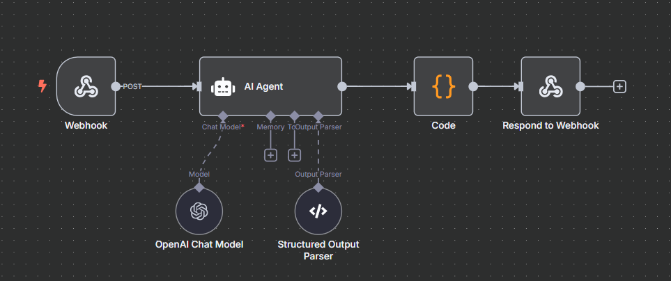

# AI-Powered Recipe Generator

An AI-powered web application that generates recipes based on the ingredients you have.  
Users can log in securely via magic link authentication, enter ingredients, and receive AI-generated recipes.  
The backend AI logic is powered by **n8n**, with data stored in **Supabase**.  

---

## Features

- **Magic Link Authentication**: Passwordless login via Supabase.
- **Dynamic Ingredient Input**: Add as many ingredients as you like.
- **AI Recipe Generation**: n8n workflow triggers an AI agent to create recipes.
- **Recipe History**: Previous recipes are stored in Supabase and shown in the UI.

---

## Tech Stack

- **Frontend**: Next.js (React + TypeScript), TailwindCSS  
- **Backend Automation**: n8n  
- **Database**: Supabase (Postgres)  
- **Authentication**: Supabase Magic Link  

---

## 🌐 Live Demo

Check out the live version of this website here:  
👉 [https://nexium-ansh-project.vercel.app/](https://nexium-ansh-project.vercel.app/)

---

## Setup & Installation

1. **Clone this repository**
   ```bash
   git clone https://github.com/AnshDoultani/Nexium_Ansh_Project.git
   cd Nexium_Ansh_Project
   ```

2. **Install dependencies**
   ```bash
   npm install
   ```

3. **Set up environment variables**
   Create a `.env.local` file in the root:
   ```
   NEXT_PUBLIC_SUPABASE_URL=your-supabase-url
   NEXT_PUBLIC_SUPABASE_ANON_KEY=your-supabase-anon-key
   ```

4. **Run the development server**
   ```bash
   npm run dev
   ```

---

## n8n Workflow

- AI recipe generation is powered by an **n8n workflow**.
- The frontend sends ingredient lists to the n8n webhook.
- The workflow calls the AI model, formats the recipe, and returns it to the frontend.


